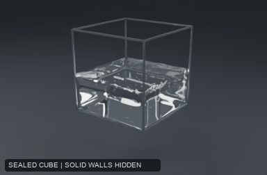
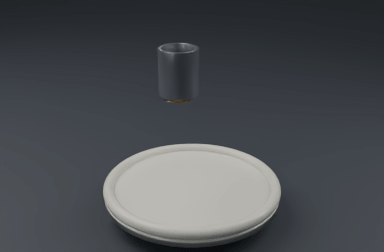

# Halation Fluid

**GPU liquid and smoke simulation, built in Rust with wgpu.**

*Moving boundaries: a prescribed drop and rotation drive the container while the liquid responds. The solid walls are hidden to reveal the surface.*

I built Halation's fluid engine from GPU simulation kernels through reusable caches and a Houdini integration. It combines **FLIP/APIC liquids** with **Eulerian smoke and fire**, with numerical tests and visual comparisons guiding development. It grew out of [Halation](https://github.com/nat-bishop/halation), my procedural 3D application. The implementation remains private.

*Viscous pouring: an animated source lays down a thick ribbon. The circular pattern follows the source motion.*

Both studies use a 64³ liquid grid and four seconds of simulated motion, rendered in Cycles from Halation's native caches.

## Building the engine

The liquid solver couples particles to a staggered velocity grid, with pressure and density projection, adaptive substeps, viscosity, surface tension and surface reconstruction. Dense and narrow-band storage support different workloads; the gas solver uses sparse GPU storage and exports OpenVDB volumes.

The engineering extends beyond a single solve. A shared native session handles batch and persistent execution, committed frame outputs, checkpoint recovery and cache reuse after edits. Hosts evaluate geometry, animation and units; the engine owns simulation state. That boundary lets the same liquid engine serve Halation and Houdini.

## Every change had to earn its place

- **Benchmark gates.** I tracked compute cost alongside divergence, finite values, bounded mass and deterministic replay. A faster result had to preserve the relevant numerical checks.
- **Testing the reference itself.** I built a high-accuracy golden solve, then found that comparing against it favored the advection method used to create it. Analytical advection tests and energy spectra replaced that score as acceptance criteria. They confirmed a useful improvement and rejected a noisier alternative that initially looked more detailed.
- **Blind visual rankings.** I watched real flume footage, then ranked shuffled simulation variants before revealing their settings. These were my own recorded judgments, anchored to real water. The results exposed differences between numerical accuracy and visual preference, including a preference for a softer surface-tension variant in one later comparison.

### Historical performance snapshot

Dense smoke benchmark, June 23, 2026, on an **NVIDIA RTX PRO 6000 Blackwell Workstation Edition**. Configuration: `consistent-mg-mac`, four multigrid V-cycles.

| Grid | Measured time per simulation step |
|---|---:|
| 128³ | 3.12 ms |
| 256³ | 8.08 ms |
| 384³ | 30.71 ms |

These are simulation-only measurements, excluding rendering and cache output. They describe this historical dense-gas configuration; liquid and current sparse workloads have different costs.

## Inside Houdini

The liquid engine also runs behind a Houdini SOP asset with three inputs: **initial liquid, liquid source and collider**. Ordinary SOP geometry and animation drive the simulation. The node returns particles, fields or a native surface mesh, with Houdini's Particle Fluid Surface and File Cache available downstream.

Houdini owns scene evaluation and presentation; a persistent native process owns the solve and its cache. The integration has been tested in **Houdini 22.0.368 Apprentice on Windows 11**, using NVIDIA hardware and Vulkan.

**Stack:** Rust · wgpu · WGSL · Python · Houdini · OpenVDB · Cycles

Built by [Nat Bishop](https://github.com/nat-bishop). Project showcase; source and installable packages remain private.

© 2026 Nat Bishop. All rights reserved.
